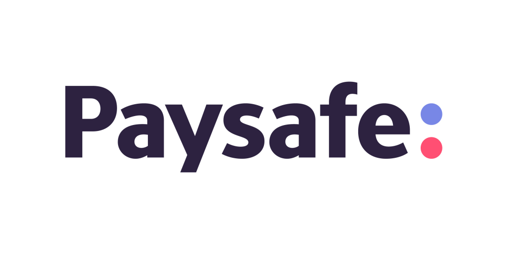

<div align="center" id="top"> 
  
</div>

<h1 align="center">PaySafe</h1>

<p align="center">
  
   
  
</p>

<br>

## :sparkles: Features

- Voting power for investors
- Automatic profit distribution
- Graphs analysis for of gross profit, liquidity ratio, quick asset ratio etc.
- Performance modelling of startups using machine learning
<br></br>
## :eyes: [Preview](https://meta-meet.vercel.app)

          
 
 
 
  
 
 
 
  


## :tada: Local setup

Before starting :checkered_flag:, you need to have [Git](https://git-scm.com) and [Node](https://nodejs.org/en/) installed.

```bash
# Clone this project
$ https://github.com/Yash621/pay-safe.git

$ cd pay-safe

# Install all the dependencies
$ yarn

# Run server for running the project
$ yarn dev

```
Made with :heart: by <a href="https://github.com/Yash621" target="_blank">Yash Goel</a>

&#xa0;

<a href="#top">Back to top</a>


